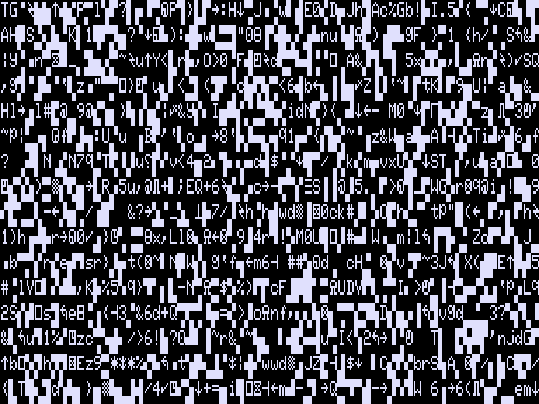
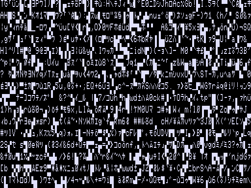
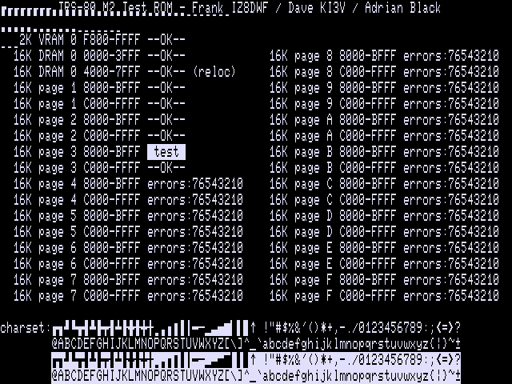

# TRS-80 Diagnostic ROM

Model I with 4K:

Model III with 48K:

Model II with 128K:

#### Main contributors:
- Dave Giller KI3V - Programmer and designer
- Frank IZ8DWF - Testing methodology and initial test routines
- Adrian Black - Testing, initial concept and QA

## Introduction from Adrian

This project was born out of a broken TRS-80 Model III that I was working on. I could not tell if the system was even "executing code," so I used an early version of this ROM to help diagnose the problem.

Please know that the main goal of this ROM is to test the functionality of the video RAM (VRAM) and the dynamic RAM (DRAM, system memory.) It does not test any other component unrelated to those two subsystems. If a TRS-80 has good VRAM and DRAM, it should boot into basic where you can then run further tests. 

You should familiarize yourself with the system schematics and design of the TRS-80 before using this ROM since problems in other areas of the system can sometimes manifest themselves of a RAM problem. 

Videos:
- [Part 1](https://youtu.be/EGFKjjlvKf4)
- [Part 2](https://youtu.be/Hh8dRgtu1Jk)
- [Companion Video (ROM deep dive)](https://youtu.be/4fuuyLiSgsE)

In addition, most (all?) RAM tests contained inside diagnostic ROMs on various systems use a very rudimentary RAM test that are inadequate to detect subtle RAM problems. While the test in this ROM isn't the end-all, be-all of RAM tests, we feel it is better than the typical simple bit pattern tests used elsewhere. The RAM test implemented here is a "march" test, which we have found to be much more reliable at detecting a variety of different RAM fault modes.

## Feature List

- ***Working DRAM or VRAM is not required.***  The initial release of this ROM could use 8-bit VRAM for its stack, or use the first bank of DRAM as a stack if it tested good.  This ROM now does not require a stack, and can run on a machine with faults in both VRAM and DRAM.  For more information, see [this explanation of the techniques used to operate in the absence of working RAM](spt.md).
	- Keep in mind however, that other faults, such as address line problems, can keep this (or any) ROM from running properly.
- One ROM image for **TRS-80 Model I, or III**
	- Audio feedback via the cassette port, so you can tell what's happening even if you have no video display.
	- Auto detection of VRAM type (The Model I comes with 7-bit VRAM)
	- Auto detection of bank size (4k or 16k)
		- A machine with 4K bank size cannot have RAM at 12K ($7000).  If the ROM tests that region and finds all bits bad, it assumes this is a 4K machine.
		- Officially, a machine with a 4K bank can only have 4K total, so this ROM does not test beyond the first bank in that case.
	- Testing up to 48k of DRAM, looping continually.
- One ROM image for **TRS-80 Model II** with all DRAM sizes.
	- The same image is expected to work with the Model 12, 16, or 6000, although this is not tested.
	- Testing up to 512k of DRAM, looping continually.
	- Temporarily relocates the test subroutine into previously tested RAM at `$4000` and unmaps the ROM from Z80 address space to test the RAM between `$0000` and `$3FFF`.
		- The stock ROM does not test the region of DRAM from `$0000`-`$0FFF` that is hidden while the ROM is mapped.
- All ROM images fit within 2K so the ROM can be used on any machine in the range

## Future improvements

- Testing the ROM on "Big Tandy" systems like the Model 12, 16, and 6000.
- Porting to the Model 4
- Porting the diagnostic routines to other Z80 systems
	- Kaypro II'83, 4'83, 10, 2'84, 4'84, 1
- More comprehensive documentation

# What the ROM does

- Makes sounds to let you know the ROM is running even if the display is not operating properly:
	- On the Model I/III:
		- Makes a beep from the cassette port (so you can know the system is executing the ROM.)
	- On the Model II:
		- Accesses the built-in floppy drive three times.  The activity light should activate and the head solenoid should click.
- Set the system to 64 or 80 column mode depending on the machine.
- Tests the video RAM using a March C test.
	- On the Model I/III:
		- Tests for 7-bit Model I VRAM (fake bit 6) and identifies it if found.
		- Beeps a good (rising tones) or bad (tune ending on low note) VRAM sound. 
		- If the VRAM is bad, it will show a test pattern on the screen, then beep out which bit(s) are bad repeatedly.
	- On the Model II:
		- If the VRAM is bad, it will show a test pattern on the screen, then blink the drive light on floppy 0
			- The bits of VRAM are indicated by long or short blinks, counting from bit 7 down to bit 0.
				- A long blink means that bit is bad.  A short blink means that bit is good.
- Clears screen and writes a welcome message.
- On the Model I/III:
	- If the first bank of DRAM only has 4K:
		- Tests that first bank of 4k repeatedly.
	- If the first bank of DRAM is 16k:
		- Tests all three DRAM banks (48K) repeatedly.  Missing banks (e.g., for a 16K or 32K machine) will be listed with all bits in error (`76543210`).
	- After each test, the diagnostic will play a good bank or bad bank tune. If a bad bank exists, it will beep out which bits are bad and print this to screen.
- The Model II can (theoretically) have up to 512K of DRAM:
	- The first 32K of DRAM (from `$0000` to `$7FFF`) is always present, but at boot time, the ROM is mapped in and makes the RAM from `$0000` to `$0FFF` inaccessible.
		- The diagnostic first tests the second physical bank of DRAM located at `$4000-$7FFF`.  
			- If that bank passes testing, the ROM copies a portion of itself to `$4000`, and passes control to this copy.
				- The relocated copy unmaps the ROM, exposing all of RAM from `$0000` to `$3FFF`, which it then tests.  Afterwards, it re-maps the ROM to appear at `$0000` again, and hands control back to the ROM.
			- If the bank at `$4000-$7FFF` fails testing, the ROM skips the test of DRAM from `$0000` to `$3FFF`.
		- Then the diagnostic tests all possible DRAM pages (`$0-$F`), bank-switching them in turn into the region `$8000-$FFFF`.

# Running this diagnostic ROM on a TRS-80 Model I or Model III

To use this diagnostic ROM on a TRS-80 Model III, you must first make or buy an adapter to allow use of an EPROM in the U104 ROM socket. This socket is designed for a 2364 which does not have a compatible pinout with a 2764 EPROM. Adapter PCBs are widely available on the usual sources, or you can make some PCBs at this link:

[PCBway Project Link for EPROM adapter](https://www.pcbway.com/project/shareproject/Adapter_2364___27128__by_Bobbel_.html)

The assembled ROM, ready to be burned to EPROM or EEPROM, is `trs80testrom.bin` or `trs80testrom.hex`.  Both contain the same ROM image, so you can use whichever is more convenient with your EPROM programmer's software.

One you have a programmed 2764 or 28B64C, insert that into the adapter and install it into U104 on the Model III. This is the boot ROM that the CPU starts to execute code from at power-up.  (Address `$0000`)
  
On a TRS-80 Model I with Level II ROM upgrade, the main boot rom is the left most chip. On the Model I, the main ROM is a 2332 ROM chip, so a 2732 should work in place of it. _(Unconfirmed and untested.)_ Adrian used his 2364 to 2764 adapter in this socket and it mostly worked after he wrote the ROM into the top half of the 28B64 due to one address line being tied to VCC. (Load the ROM image into address `$1000` in your EPROM software before writing, so it is mapped to `$0000` on the Model I.)
  
- The beep codes for bit errors are as follows:
	- First a long middle tone is played:
		- A single tone for the first bank, two for the second, and three for the third
	- Then after a short pause, the good/bad bits are identified:
		- If all bits are good, a long high tone is played.
		- If all bits are **bad**, a long **low** tone is played.
		- If some bits are good and some bad, the bits are identified starting with bit 7 and counting down to bit 0:
			- A short high tone indicates this bit is good.
			- A short **low** tone indicates this bit is bad.
- For example, if your second 16K bank (locations `$8000-$BFFF`) have bits 5 and 3 bad, the following tones will play:
	- MID(long) MID(long) (pause) HI HI **low** HI **low** HI HI HI
- If _only_ bit 6 of VRAM is bad, the diagnostic will further test to see if bit 6 is "faked" as the NOR of bits 5 and 7.  
	- If it is, you will not hear a beep code because the ROM identifies this as the normal 7-bit VRAM in a stock Model I machine.
	- If bit 6 of VRAM is not consistently the NOR of bits 5 and 6, the screen will be filled with copies of the character set, and the error will be repeatedly reported as tones (HI&nbsp;**low**&nbsp;HI&nbsp;HI&nbsp;HI&nbsp;HI&nbsp;HI&nbsp;HI, identifying bad bit 6).

# Running this diagnostic ROM on a TRS-80 Model II

***WARNING***: **You use this ROM (or really, do any troubleshooting inside a Model II or its derivatives) at your own risk!*** 

The CRT on the Model II (and all of the "Big Tandy" machines that use a 6845 CRT Controller chip) are susceptible to damage if they are powered on and run without a valid signal from the video controller board.  It is ***imperative*** that you are careful to connect all of the video-related cables properly.  Also, while we have tested this ROM to program the CRTC correctly, if your EPROM chip is not programmed successfully or not inserted into the ROM socket correctly such that no ROM code runs, your CRT may be damaged!  Even if you are sure everything has been prepared correctly, make sure you are ready to cut power if you hear strange sounds from the CRT or anything doesn't seem right.  The technial manuals suggest that you have roughly ***3 seconds*** to cut power before there is risk of damage to the CRT.

Do note: this code currently depends on proper operation of the FDC.  Specifically it awaits proper responses from the FDC while it toggles the activity light and head loading solenoid on and off.  In the near future this will be modified to wait appropriate time periods, but not to rely on the data read from the locations where the FDC status registers should be.

_This section to be completed._

## Other troubleshooting notes

- On the Model III, you **must** have a working connection between JP2A and JP2B to run this diagnostic. Both the cassette port (for audio output) and the video subsystem is accessed by the CPU via this interconnect. Bits 0 and 1 of this interconnection are needed for the cassette port audio, but all 8 bits are required for video to work. 
- You do not need the interconnect between JP1A and JP1B. This is used by only the floppy and serial board. The system will operate fine without the interconnect, but you will not be able to use the floppy or serial port. 
- On the Model III, the cassette port output is the pin closest to the keyboard connector (Connector J3). On the Model I, you can either clip a test lead onto the cassette port, or use the cassette DIN cable to get audio output. 
- You do not need any DRAM installed in the machine for the diagnostic to run. If you have good working VRAM but no working DRAM, you should see the DRAM tests run, and all banks will come back as bad. 
- Keep in mind a stuck or bad DRAM bus transceiver can trash the entire bus, causing the VRAM test to also fail.
- You do not need the keyboard connected for the system to run the diagnostic. The keyboard is not used during the test at all.
- The diagnostic ROM **must** be installed into U104 on the TRS-80 Model III. You must use a 2364 to 27XXX adapter. The one Adrian used is made for 27128 devices, but it works just fine with 2764 and more conveniently 28B64C (EEPROMs.) 
- You can also use this same adapter in U105 (for testing replacement of that ROM, **not** for running this diagnostic ROM). You can use a normal 2716 in U106 if you need to test replacing that ROM.
- You do not need to have any ROM installed in U105 or U106 during the test, as they are not used by the diagnostics. A bad ROM in one of those sockets could cause the computer to not work, so if even this diagnostic ROM does not work, it would be advisable to try pulling those ROMs.

## Knowing what might be wrong

The Model III motherboard layout is shown above. I recommend referring to the Radio Shack Technical Service Manual for help in identifying what components might be bad on your system, but the picture should give you a head-start.

The Model I motherboard has only 1 bank of DRAM, which can 4k or 16k. If the system has 16k, then an additional 32k can be installed in an attached expansion interface.

For the ROM position in the Level II PCB, you must figure out which ROM is the lower ROM. You may have to look up part numbers of the chips to figure that out. 

## Building

This repository will contain the assembled ROM image.  To assemble, you will need to use [George Phillips' `zmac` assembler](http://48k.ca/zmac.html).  

Many thanks to George also for his [excellent `trs80gp` emulator](http://48k.ca/trs80gp.html) which includes integrated debugging facilities which dramatically reduced the time necessary to develop and debug these diagnostics.
